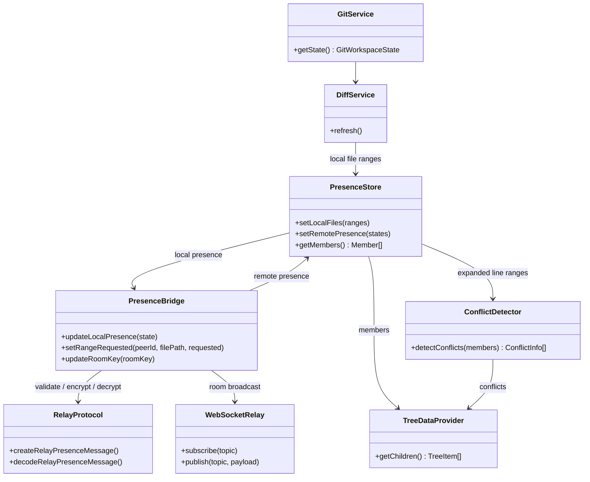

# camp-diff クラス図

同期処理はExtension Host内で完結し、Webviewやエディタタブを生成しません。

```mermaid
classDiagram
    class GitService {
        +getState() GitWorkspaceState
    }
    class DiffService {
        +refresh()
    }
    class PresenceStore {
        +setLocalFiles(ranges)
        +setRemotePresence(states)
        +getMembers() Member[]
    }
    class PresenceBridge {
        +updateLocalPresence(state)
        +setRangeRequested(peerId, filePath, requested)
        +updateRoomKey(roomKey)
    }
    class RelayProtocol {
        +createRelayPresenceMessage()
        +decodeRelayPresenceMessage()
    }
    class WebSocketRelay {
        +subscribe(topic)
        +publish(topic, payload)
    }
    class TreeDataProvider {
        +getChildren() TreeItem[]
    }
    class ConflictDetector {
        +detectConflicts(members) ConflictInfo[]
    }

    GitService --> DiffService
    DiffService --> PresenceStore : local file ranges
    PresenceStore --> PresenceBridge : local presence
    PresenceBridge --> PresenceStore : remote presence
    PresenceBridge --> RelayProtocol : validate / encrypt / decrypt
    PresenceBridge --> WebSocketRelay : room broadcast
    PresenceStore --> TreeDataProvider : members
    PresenceStore --> ConflictDetector : expanded line ranges
    ConflictDetector --> TreeDataProvider : conflicts
```

常時送るのはユーザー情報と変更中のファイルパスです。行範囲は相手がツリーのファイル行を展開して要求した間だけ送ります。`campDiff.roomPassword`が設定されている場合、中継payloadはAES-256-GCMで暗号化されます。
