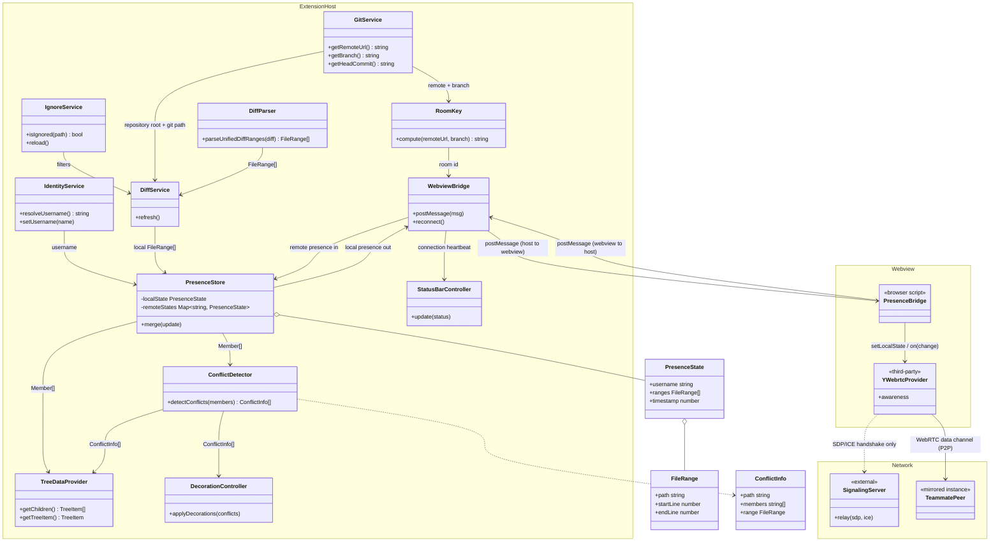

# camp-diff クラス図（ドラフト）

`docs/implementation-plan.md` のフォルダ構成をもとにした、主要クラス/モジュールの関係図。Extension Host・Webview・ネットワークの3領域に分けて表示している。試作段階のスケッチなので、実装が進んだら乖離がないか見直すこと。

## 見方

- **ExtensionHost**: Node.jsプロセス側のクラス群。`docs/implementation-plan.md`のフォルダ構成にある`src/git`〜`src/ui`に対応。
- **Webview**: 隠しWebviewPanel内で動くブラウザ側スクリプト。`y-webrtc`は自前クラスではなくサードパーティ。
- **Network**: シグナリングサーバー（SDP/ICEの中継のみ）とチームメイト側のインスタンス（同じ構造のミラー）。
- `WebviewBridge`⇄`PresenceBridge`間の`postMessage`が、Extension HostとWebviewというプロセス境界を越える唯一の経路。
- `YWebrtcProvider`から先、実際のpresenceデータ（ファイルパス・行範囲）が流れるのは`TeammatePeer`への実線（WebRTC data channel）のみで、シグナリングサーバーへは点線（ハンドシェイクのみ）にとどまる。
